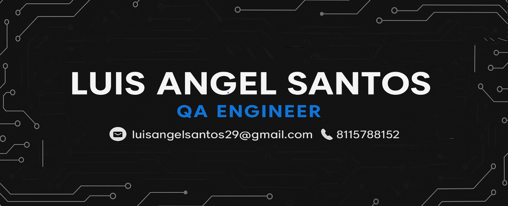

  

Hola Soy Luis

Apasionado por la calidad del software y en constante formación como **QA Engineer** 🔍.  

🛠 Actualmente estoy perfeccionando mis habilidades con proyectos prácticos, después de una experiencia previa colaborando en:
- Pruebas funcionales y de regresión
- Reporte de bugs
- Soporte en automatización con **Python + Selenium**

🎓 Recientemente completé un bootcamp intensivo donde trabajé con:
- **Postman** para pruebas de API
- **Pruebas automatizadas básicas** con Selenium
- **Testing móvil** y análisis con **DevTools**

🚀 Busco oportunidades donde pueda seguir creciendo y contribuir a equipos enfocados en la calidad del software.

📫 ¿Quieres contactar conmigo? 

- 📧 [Correo: luisangelsantos29@gmail.com](mailto:luisangelsantos29@gmail.com)
- 📱 Teléfono: 8115788152
- 🔗 [LinkedIn](https://www.linkedin.com/in/luisangelsantos)
- 💻 [GitHub](https://github.com/KabyStrato66)
